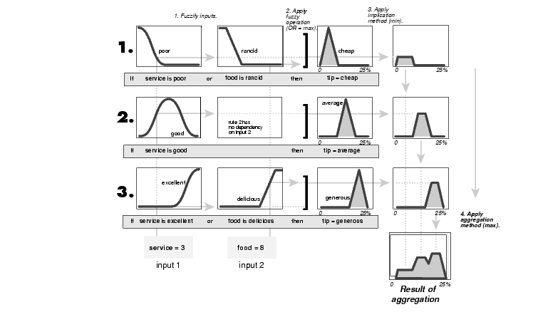
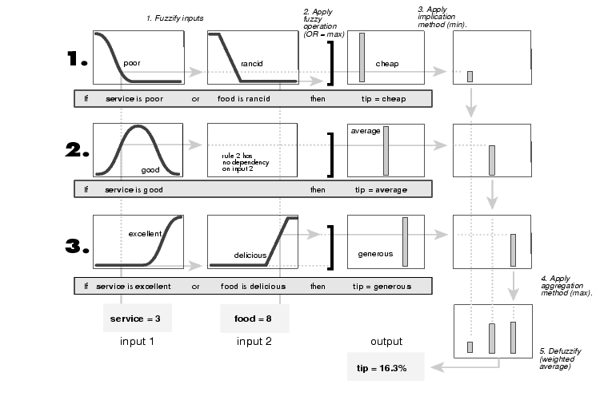
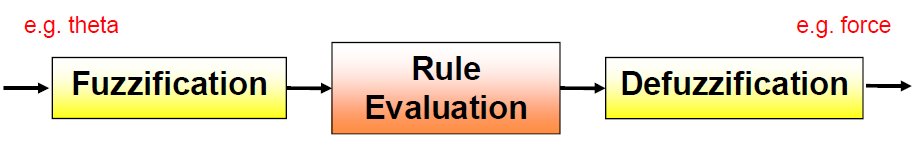

## Fuzzy Inference
Fuzzy inference is the process of formulating the mapping from a given input to
an output using fuzzy logic. The mapping then provides a basis from which
decisions can be made, or patterns discerned.

### Mamdani Fuzzy Inference System
Mamdani-type inference, expects the output membership functions to be fuzzy
sets. After the aggregation process, there is a fuzzy set for each output variable that
needs defuzzification.



### Sugeno Fuzzy Inference System
Sugeno FIS is similar to the Mamdani method in many respects. The first two parts of
the fuzzy inference process, fuzzifying the inputs and applying the fuzzy operator, are
exactly the same. The main difference between Mamdani and Sugeno is that the
Sugeno output membership functions are either linear or constant.

A typical rule in a Sugeno fuzzy model has the form:      
```
If Input 1 = x and Input 2 = y, then Output is z = ax + by + c
```

For a zero-order Sugeno model, the output level z is a constant (a= b =0).



#### Advantages of the Sugeno Method
* It's computationally efficient.
* It works well with linear techniques (e.g., PID control).
* It works well with optimization and adaptive techniques.
* It has guaranteed continuity of the output surface.
* It's well-suited to mathematical analysis.

#### Advantages of the Mamdani Method
* It's intuitive.
* It has widespread acceptance.
* It's well-suited to human input

--------------------------------------------------------------------------------------
## Fuzzy Inference Process


* **Fuzzification**: Translate input into truth values
* **Rule Evaluation**: Compute output truth values
* **Defuzzification**: Transfer truth values into output

