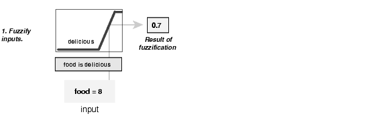
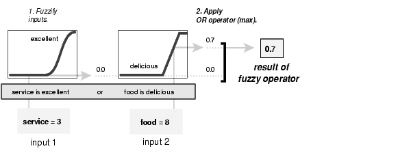

## Fuzzy Inference Systems

#### Example
We provide the same two-input one-output three-rule tipping problem.   
The basic structure of this example is shown in the diagram below.   

#### Step 1. Fuzzify Inputs
The first step is to take the inputs and determine the degree to which they belong to each of the appropriate fuzzy sets via membership functions. In the Fuzzy Logic Toolbox, the input is always a crisp numerical value limited to the universe of discourse of the input variable (in this case the interval between 0 and 10) and the output is a fuzzy degree of membership in the qualifying linguistic set (always the interval between 0 and 1). Fuzzification of the input amounts to either a table lookup or a function evaluation.         
If we rated the food as an 8, which, given our graphical definition of delicious, corresponds to µ = 0.7 for the "delicious" membership function.      

#### Step 2. Apply Fuzzy Operator
Once the inputs have been fuzzified, we know the degree to which each part of the antecedent has been satisfied for each rule. If the antecedent of a given rule has more than one part, the fuzzy operator is applied to obtain one number that represents the result of the antecedent for that rule. This number will then be applied to the output function. The input to the fuzzy operator is two or more membership values from fuzzified input variables. The output is a single truth value.      

We're evaluating the antecedent of the rule 3 for the tipping calculation. The two different pieces of the antecedent (service is excellent and food is delicious) yielded the fuzzy membership values 0.0 and 0.7 respectively. The fuzzy OR operator simply selects the maximum of the two values, 0.7, and the fuzzy operation for rule 3 is complete. If we were using the probabilistic OR method, the result would still be 0.7 in this case.    
 

#### Step 3. Apply Implication Method
