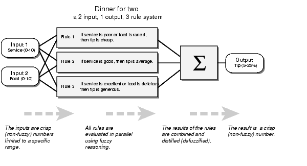
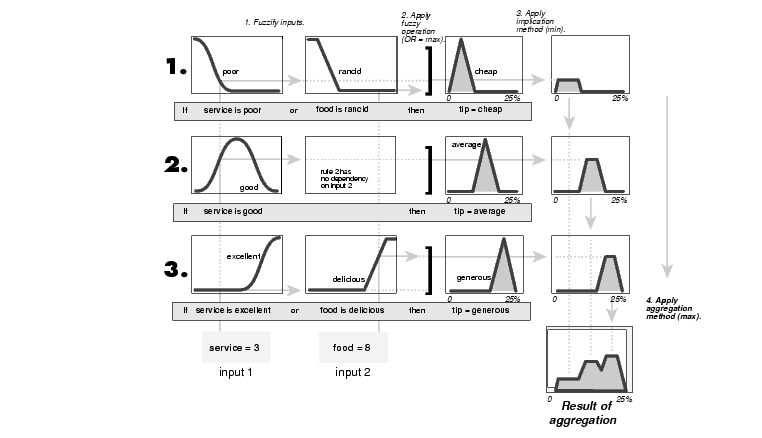

## Fuzzy Inference Systems

#### Example
We provide the same two-input one-output three-rule tipping problem.   
The basic structure of this example is shown in the diagram below.   

#### Step 1. Fuzzify Inputs
The first step is to take the inputs and determine the degree to which they belong to each of the appropriate fuzzy sets via membership functions. In the Fuzzy Logic Toolbox, the input is always a crisp numerical value limited to the universe of discourse of the input variable (in this case the interval between 0 and 10) and the output is a fuzzy degree of membership in the qualifying linguistic set (always the interval between 0 and 1). Fuzzification of the input amounts to either a table lookup or a function evaluation.         
If we rated the food as an 8, which, given our graphical definition of delicious, corresponds to µ = 0.7 for the "delicious" membership function.      

#### Step 2. Apply Fuzzy Operator
Once the inputs have been fuzzified, we know the degree to which each part of the antecedent has been satisfied for each rule. If the antecedent of a given rule has more than one part, the fuzzy operator is applied to obtain one number that represents the result of the antecedent for that rule. This number will then be applied to the output function. The input to the fuzzy operator is two or more membership values from fuzzified input variables. The output is a single truth value.      

We're evaluating the antecedent of the rule 3 for the tipping calculation. The two different pieces of the antecedent (service is excellent and food is delicious) yielded the fuzzy membership values 0.0 and 0.7 respectively. The fuzzy OR operator simply selects the maximum of the two values, 0.7, and the fuzzy operation for rule 3 is complete. If we were using the probabilistic OR method, the result would still be 0.7 in this case.    
 

#### Step 3. Apply Implication Method
Before applying the implication method, we must take care of the rule's weight. Every rule has a *weight* (a number between 0 and 1), which is applied to the number given by the antecedent.

Once proper weighting has been assigned to each rule, the implication method is implemented. A consequent is a fuzzy set represented by a membership function, which weights appropriately the linguistic characteristics that are attributed to it. The consequent is reshaped using a function associated with the antecedent (a single number). The input for the implication process is a single number given by the antecedent, and the output is a fuzzy set. Implication is implemented for each rule. Two built-in methods are supported, and they are the same functions that are used by the AND method: min (minimum), which truncates the output fuzzy set, and prod (product), which scales the output.

#### Step 4. Aggregate All Outputs
Since decisions are based on the testing of all of the rules in an FIS, the rules must be combined in some manner in order to make a decision. Aggregation is the process by which the fuzzy sets that represent the outputs of each rule are combined into a single fuzzy set. Aggregation only occurs once for each output variable, just prior to the fifth and final step, defuzzification. The input of the aggregation process is the list of truncated output functions returned by the implication process for each rule. The output of the aggregation process is one fuzzy set for each output variable.

#### Step 5. Defuzzify

The input for the defuzzification process is a fuzzy set (the aggregate output fuzzy set) and the output is a single number. As much as fuzziness helps the rule evaluation during the intermediate steps, the final desired output for each variable is generally a single number. However, the aggregate of a fuzzy set encompasses a range of output values, and so must be defuzzified in order to resolve a single output value from the set.

There are five built-in methods supported: centroid, bisector, middle of maximum (the average of the maximum value of the output set), largest of maximum, and smallest of maximum.

