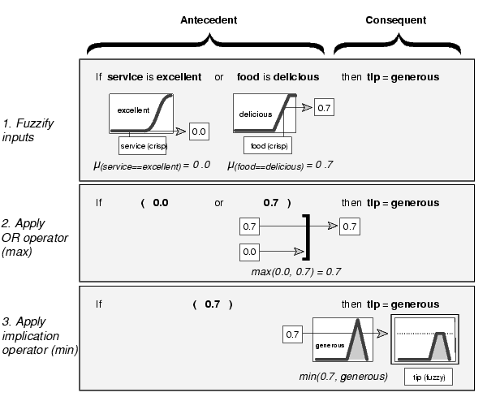

### If-Then Rules
 

Interpreting if-then rules is a three-part process. 
1. **Fuzzify inputs**: Resolve all fuzzy statements in the antecedent to a degree of membership between 0 and 1.
2. **Apply fuzzy operator to multiple part antecedents**
3. **Apply implication method**: Use the degree of support for the entire rule to shape the output fuzzy set. 
