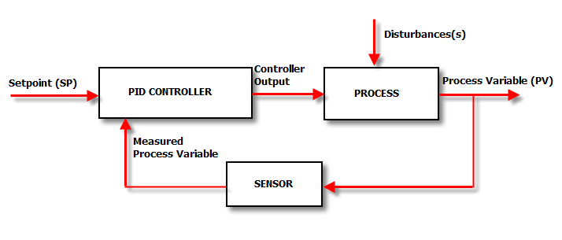
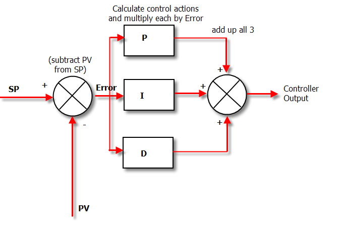
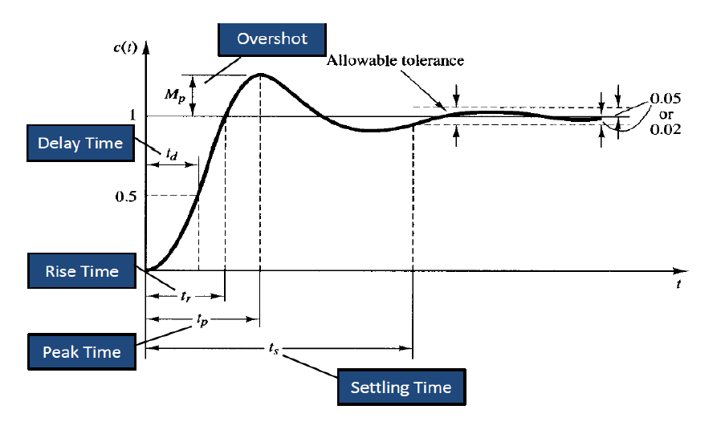

# PID

PID stands for **P**roportional **I**ntegral **D**erivative
3 separate parts joined together, though sometimes you don't need all three.

##### PID controller in system


##### Under The Hood Of The PID Controller


PID Python Example:
[Eg1](PID_Python/PID.ipynb), [Eg2_Simple](PID_Python/PID_Simple.ipynb), [Eg3_Compare](PID_Python/PID_Variable_Comparision.ipynb)

Imagine a robot that travels at full speed, and we want to stop it.
### P
P controller controls the speed smoothly, allowing it to slow down as it approaches it's targettarget, to shrink the overshoot.

That's why it is called a proportional controller – the output speed is proportional to the value remaining to be changed, which we call an **error**.
```
error = (target value) – (sensor reading)
speed = Kp * error
```
Example of error:

| Target value | Current sensor reading | Error |
|--------------|------------------------|-------|
| 1000         | 200                    | 800   |
| 1000         | 400                    | 600   |
| 1000         | 600                    | 400   |
| 1000         | 800                    | 200   |
| 1000         | 1000                   | 0     |

You may see the error oscillating, overshooting then over-correcting.

### I
So the proportional part of the code has got it so that the error remaining is pretty small.
Too small for the proportional section to make much of a difference. This is where the
integral comes in. 
The integral is the *running sum of previous errors*.
```
error = (target value) – (sensor reading);
integral = integral + error;
speed = Kp*error + Ki*integral;
```

| Cycle # | Previous value for integral | Error | New value for integral |
|---------|-----------------------------|-------|------------------------|
| 0       | 0                           | 2     | 2                      |
| 1       | 2                           | 2     | 4                      |
| 2       | 4                           | 2     | 6                      |
| 3       | 6                           | 2     | 8                      |
| 4       | 8                           | 2     | 10                     |

Sometimes, use 
```
Integral = integral + error*dT;
```
Delta time is needed when the loop may not always be taking the same time to complete each cycle, but when the cycles all take the same amount of time to complete as each other, the dT can be merged into the Ki. If the cycles don't take the same amount of time to complete, simply get the code to time itself each cycle and then you can use that time as your delta time.

#### Problem with integral
#### Problem 1
When your error finally reaches 0, your integral will probably still be at a value which keeps the speed high enough to keep the error changing. The equation will only reach 0 by itself if it passes past an error of 0, so the negative error can subtract into the existing integral.
So, if the speed is still high enough to keep the error changing, we have a problem, right? There is a very simple solution to this problem, and that is to reset the integral if the error reaches 0. This can be done as follows. The fix in the code is in bold text.

```
Kp = 0.5;
Ki = 0.2;
while (condition){
    error = (target value) – (sensor reading);
    integral = integral + error;
    if (error is 0){
        integral = 0;
    }
    speed = Kp*error + Ki*integral;
}
```

#### Problem 2
It is known as integral wind-up. It can start by if you have a large error to travel, the integral will start to build up once the loop starts to run. So, by the time the integral needs to be used, it is already at a value far higher than is usable. There are simple solutions to this issue

##### Solution 1:
Limit the value that the integral can reach. If it is reaching too high, why not just put a limit on it?
```
if (integral is greater than or equal to the maximum value){
    integral = maximum value;
}
```
But, if the integral is too big but in it's negative form (i. i. making the speed reverse too fast), you would need to rewrite the same as above but for the negative version of the integral.

##### Solution 2:
Limit the range in which the integral is allowed to build up in. So if the error is too big for the integral to be useful in, we could just disable the integral for that area.
```
if ( error is greater than useful for the integral ){
    disable the integral (set the integral to 0);
}
```
But again, just like for in solution #1, you would need to rewrite the same but for the negative values for the integral. Or, if your programming language supports the use of an absolute tool, you could use that to make the code shorter, and perhaps, more simple too.
```
if ( abs(error) is greater than useful for the integral){
    disable the integral (set the integral to 0);
}
```

Eg:
```
Kp = 0.5;
Ki = 0.2;
while (condition){
    error = (target value) – (sensor reading);
    integral = integral + error;
    if (error = 0){ 
        integral = 0;
    }
    if ( abs(error) > 40){ 
        integral = 0;
    }
    speed = Kp*error + Ki*integral;
}
```


##### Solution 3:
Restrain the amount of time the integral is allowed to build up in. This would a little more complicated to program, but still possible.

### D
The job of the derivative is to predict the future value for the error, and then make the speed act accordingly. For example, if it thinks it will overshoot, it will slow it down.
```
derivative = ( (current error) – (previous error) ) / dT
```
This will find the change between the current error and the previous error, and then we could use that to find the next error by adding it to the current error. Just like with the integral, the derivative is effected by dT, but providing that the time it takes to complete one cycle of the loop is always the same, the dT can be merged into Kd.

| Current error | Previous error | Derivative | Future error (error + derivative) |
|---------------|----------------|------------|-----------------------------------|
| 50            | 55             | -5         | 45                                |
| 20            | 30             | -10        | 10                                |
| 2             | 3              | -1         | 1                                 |
| 5             | 15             | -10        | -5                                |


Pseudocode for the full PID controller:
```
Kp = 0.5;
Ki = 0.2;
Kd = 0.1;

while (condition){
    error = (target value) – (sensor reading);
    integral = integral + error;
    if (error = 0){ 
        integral = 0;
    }
    if ( abs(error) > 40){ 
        integral = 0;
    }
    derivative = error – previous_error;
    previous_error = error;
    speed = Kp*error + Ki*integral + Kd*derivative;
}
```

## Tuning the constant terms
* **Rise time** – the time it takes to get from the beginning point to the target point
* **Overshoot** – the amount that is changed too much; the value further than the error
* **Settling time** – the time it takes to settle back down when encountering a change
* **Steady-state error** – the error at the equilibrium
* **Stability** – the “smoothness” of the speed



What happens when each of the constants is increased

| Constant | Rise time    | Overshoot | Settling time | Steady-state error | Stability                 |
|----------|--------------|-----------|---------------|--------------------|---------------------------|
| Kp       | decrease     | increase  | Small change  | decrease           | degrade                   |
| Ki       | decrease     | increase  | increase      | decrease           | degrade                   |
| Kd       | minor change | decrease  | decrease      | No effect          | Improve (if small enough) |


#### Common tunning methods
* Manual Tuning Method
* Ziegler-Nichols Tuning Method
* Cohen-Coon Tuning Method
* PID Tuning Software Methods (ex. MATLAB)

Suggested way to tune constants is as follows:
1. Set Kp, Ki, and Kd to 0. This will disable them for now.
2. Increase Kp until the error is fairly small, but it still gets from the beginning to nearly
the end quickly enough.
3. Increase Kd until any overshoot you may have is fairly minimal. But be careful with
Kd – too much will make it overshoot.
4. Increase Ki until any error that is still existing is eliminated. Start with a really small
number for Ki, don't be surprised if it is as small as 0.0001 or even smaller.
5. Using the rules of tuning the constants (in the table on the previous page), you can
change around the constants a little bit to get it working to the best performance.

For small, low torque motors with little or no gearing, one procedure you can use to get a good baseline tune is to probe it's response to a disturbance.

To tune a PID use the following steps:
1. Set all gains to zero.
2. Increase the P gain until the response to a disturbance is steady oscillation.
3. Increase the D gain until the the oscillations go away (i.e. it's critically damped).
4. Repeat steps 2 and 3 until increasing the D gain does not stop the oscillations.
5. Set P and D to the last stable values.
6. Increase the I gain until it brings you to the setpoint with the number of oscillations desired (normally zero but a quicker response can be had if you don't mind a couple oscillations of overshoot)


Reference:
1. http://ctms.engin.umich.edu/CTMS/index.php?example=Introduction&section=ControlPID
2. https://www.csimn.com/CSI_pages/PIDforDummies.html

